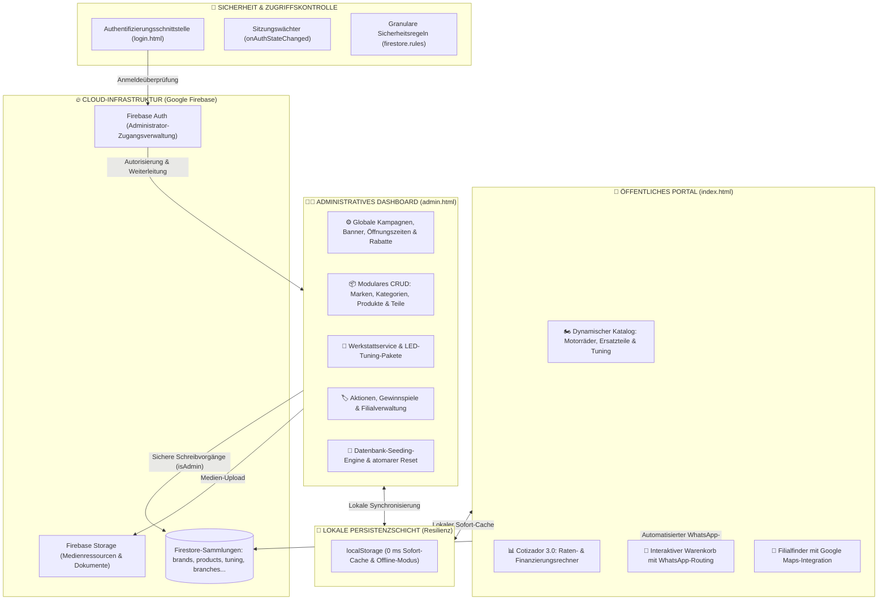

# 🏍️ AP Motors — Reaktive E-Commerce-Plattform & Echtzeit-Admin-Suite

<p align="left">
  <a href="README.md"></a>
  <a href="README.de.md"></a>
  <a href="README.es.md"></a>
</p>

> 🌐 **Verfügbare Sprachen / Languages:** [🇬🇧 English](README.md) • [🇩🇪 Deutsch](README.de.md) • [🇪🇸 Español](README.es.md)

---

[](https://apmotors-6bece.web.app)
[](https://apmotors-6bece.web.app)

[](https://developer.mozilla.org/)
[](https://developer.mozilla.org/)
[](https://developer.mozilla.org/)
[](https://firebase.google.com/)
[](https://firebase.google.com/)
[](https://firebase.google.com/)
[](https://www.whatsapp.com/)

> [!TIP]
> ### 🌐 Live-Produktionsplattform für Recruiter & Prüfer
> **Klicken Sie hier, um direkt mit der bereitgestellten Produktionsversion zu interagieren:**  
> 👉 **[https://apmotors-6bece.web.app](https://apmotors-6bece.web.app)**  
> 
> *Direkter Zugriff auf die öffentliche Hauptseite: Erkunden Sie den dynamischen Motorradkatalog, interaktive technische Datenblätter, den **Cotizador 3.0** (Finanzierungs- und Ratenrechner) sowie den Echtzeit-Angebotswarenkorb – ganz ohne Anmeldung oder Zugangsdaten.*

Willkommen bei **AP Motors**, einer hochleistungsfähigen E-Commerce- und Inventarverwaltungsplattform für Mehrmarken-Motorradhändler (autorisierter Vertragshändler für **RONCO**, **NEXUS** und **SUMO** im Süden Perus).

Das System verbindet ein **ultraschnelles öffentliches Kundenportal** mit einem zentralisierten, reaktiven **Echtzeit-Admin-Dashboard (CRUD)**, gestützt auf die serverlose Cloud-Infrastruktur von **Google Firebase (Firestore, Auth und Hosting)** sowie eine lokale Cache-Architektur mit 0 ms Latenz und nativer Offline-Fähigkeit.

---

## 🏛️ Systemarchitektur



---

## 🌟 Technische Highlights & Kernmodule

### 1. 🏍️ Reaktiver Echtzeit-Katalog
- **Bidirektionale `onSnapshot`-Synchronisierung**: Jede Änderung an Preisen, Produkten oder Bannern im Admin-Dashboard wird in Echtzeit auf allen geöffneten Client-Geräten reflektiert, ohne dass die Seite neu geladen werden muss.
- **Mehrkriterien-Filterung**: Schnelle Filterung nach offizieller Marke, Fahrzeugtyp (Arbeitsmotorräder, Sportler, offizielle Ersatzteile, LED-Tuning), Preisspannen und Verfügbarkeit.
- **Interaktive Datenblatt-Modals**: Vollständige technische Übersicht zu Hubraum (cc), Kraftstoffsystem, 1-jähriger Werksgarantie sowie direkter WhatsApp-Kontaktanfrage pro Fahrzeug.

### 2. 📊 Cotizador 3.0: Ratenrechner & WhatsApp-Dispatch
- **Interaktiver Kredit- & Ratenrechner**: Potenzielle Käufer simulieren Anzahlung (*inicial*), Laufzeiten (6, 12, 18, 24 Monate) und geschätzte monatliche Raten direkt über dynamische Schieberegler.
- **Strukturierte URL-codierte WhatsApp-Weiterleitung**: Generiert automatisch eine saubere, vorformatierte Nachricht für Vertriebsberater:
  ```text
  Hallo AP MOTORS, ich möchte ein Angebot anfordern:
  - Modell: Ronco Pantera 200cc
  - Listenpreis: S/ 5.800
  - Vorgeschlagene Anzahlung: S/ 1.500
  - Ratenplan: 12 Monatsraten
  ```

### 3. 🛒 Interaktiver Angebots- & Bestellwarenkorb
- Permanente Speicherung des Warenkorbs im Browser (`localStorage`).
- Dynamische Berechnung der Gesamtsumme inklusive Eröffnungsrabatten (z. B. 20 % Rabatt) und konsolidierte Übergabe an den Kundenservice via WhatsApp.

### 4. 👨‍💼 Enterprise-Admin-Suite (Vollständige CRUD-Verwaltung)
- **Komplette Betriebssteuerung ohne Programmierung**:
  - **Marken & Kategorien**: Anlegen, Bearbeiten und hierarchische Sortierung.
  - **Fahrzeuge & Ersatzteile**: Verwaltung von Preisen, Angebotspreisen, Spezifikationen und Bildressourcen.
  - **Werkstatt & Tuning**: Wartungspakete, Motordiagnostik und LED-Scheinwerferinstallationen.
  - **Filialen & Standorte**: Adressverwaltung, Öffnungszeiten und integrierte Google Maps-Geokoordinaten.
  - **Kampagnensteuerung**: Echtzeit-Anpassung des oberen Benachrichtigungsbanners, Rabattprozentsätze und Hotlines.
- **Automatisierte Seeding-Engine**: Ermöglicht bei einer leeren Datenbank die Initialisierung mit vollständigen Demodatensätzen per Knopfdruck.

### 5. ⚡ 0 ms Latenz & Offline-Resilienz
- Hybride Cache-Architektur: Daten werden unmittelbar aus dem `localStorage` bereitgestellt (**First Contentful Paint < 0,4 s**), während Firestore im Hintergrund eine persistente WebSocket-/Echtzeitverbindung aufbaut.

---

## 🔒 Sicherheits- & Datenschutzarchitektur

- **Prinzip der geringsten Rechte (*Least Privilege* / RBAC)**: Firestore-Zugriffsregeln (`firestore.rules`):
  - **Öffentlicher Lesezugriff (`allow read: if true`)**: Kunden können Katalogdaten, Filialen und Angebote ohne Anmeldung einsehen.
  - **Eingeschränkter Schreibzugriff (`allow write: if isAdmin()`)**: Schreib- und Löschoperationen setzen eine gültige Authentifizierung über Firebase Auth voraus.
- **Clientseitige Routenüberwachung (*Auth Guards*)**: Verwaltungsseiten (`admin.html`) prüfen den Sitzungsstatus über `firebase.auth().onAuthStateChanged` und leiten unbefugte Aufrufe automatisch zu `/login.html` um.
- **Datenschutz für Portfolio-Präsentationen**: Keine privaten Server-Schlüssel (`serviceAccountKey.json`), PEM-Zertifikate oder echten Kundendaten im Repository; alle öffentlich sichtbaren Daten verwenden standardisierte Demodaten.

---

## 📁 Projektstruktur

```text
apmotors-web/
├── index.html                  # Öffentliches Portal & reaktiver Katalog
├── login.html                  # Authentifizierungsseite (Firebase Auth)
├── admin.html                  # Zentrales Administrations-Dashboard (CRUD)
├── 404.html                    # Benutzerdefinierte 404-Fehlerseite
├── firebase.json               # Firebase Hosting CDN-Konfiguration & Header
├── .firebaserc                 # Firebase CLI-Projektverknüpfung
├── firestore.rules             # Sicherheitsregeln für Cloud Firestore
├── storage.rules               # Zugriffsregeln für Firebase Storage
├── database.rules.json         # Fallback-Regeln für RTDB
├── .gitignore                  # Strikte Ausschlussregeln für Caches & Credentials
├── LICENSE                     # Lizenz für professionelle Portfolio-Präsentation
├── README.md                   # Hauptdokumentation auf Englisch
├── README.de.md                # Vollständige Dokumentation auf Deutsch
├── README.es.md                # Vollständige Dokumentation auf Spanisch
│
├── css/                        # Modulares Stylesheet-System
│   ├── styles.css              # Frontend-Design (Responsive, Dark Theme)
│   ├── admin.css               # Dashboard-Design, Tabellen & Modals
│   └── login.css               # Design der Anmeldekarte
│
├── js/                         # Vanilla ES6+ Modulare Architektur
│   ├── firebase.js             # Firebase SDK-Initialisierung (Auth, Firestore, Storage)
│   ├── firebase.config.example.js # Vorlage für Umgebungsvariablen
│   ├── data.js                 # Datenschicht, onSnapshot-Abonnement & lokaler Cache
│   ├── main.js                 # Öffentliche Frontend-Logik, Cotizador 3.0 & Warenkorb
│   ├── admin.js                # Admin-CRUD-Logik, Validierungen & Datenbank-Seeder
│   └── login.js                # Sitzungsverwaltung & Authentifizierungslogik
│
└── assets/                     # Grafische Ressourcen & Medien
    └── img/
        ├── logo-apmotors.png   # Vektorbasiertes Markenlogo
        ├── promo-descuento-20.jpg
        ├── promo-motos-financiamiento.jpg
        └── promo-sorteo-moto.jpg
```

---

## 🚀 Erste Schritte & Bereitstellung

### Voraussetzungen
- Moderner Webbrowser (Chrome, Edge, Firefox, Safari).
- Node.js (optional, falls lokale Dev-Server oder die Firebase CLI genutzt werden).

### 🌐 1. Schnelle Live-Demo in Produktion (Cloud CDN)
Um die Plattform direkt im Browser ohne Klonen oder lokale Installation zu testen:
👉 **[Öffentliche Hauptseite aufrufen: https://apmotors-6bece.web.app](https://apmotors-6bece.web.app)**

### 💻 2. Lokale Ausführung
Das Projekt kann mit jedem statischen HTTP-Webserver ausgeführt werden:

```bash
# Option A: Mit npx serve
npx serve .

# Option B: Mit Python
python -m http.server 8080

# Option C: Mit der Erweiterung "Live Server" in VS Code über index.html
```

Öffnen Sie die Hauptseite im Browser:
- **Hauptseite**: `http://localhost:8080` (oder `http://localhost:8080/index.html`)

### 🚀 3. Bereitstellung auf Firebase Hosting
So stellen Sie Ihre eigene Instanz in Firebase bereit:

```bash
# 1. Firebase CLI installieren
npm install -g firebase-tools

# 2. Bei Firebase anmelden
firebase login

# 3. Hosting und Sicherheitsregeln bereitstellen
firebase deploy
```

---

## 📄 Lizenz & Geistiges Eigentum

**Copyright © 2026 Cristhian PE — AP Motors. Alle Rechte vorbehalten.**

Dieses Repository wird **ausschließlich zu Zwecken der technischen Demonstration, architektonischen Veranschaulichung und professionellen Beurteilung durch Recruiter und Technische Führungskräfte veröffentlicht**. Die unbefugte kommerzielle Vervielfältigung, Verbreitung oder Verwertung der Software oder ihres Quellcodes ist untersagt. Einzelheiten entnehmen Sie der Datei [`LICENSE`](LICENSE).

---

© 2026 **AP Motors** • Entwickelt von **Cristhian PE** • Professionelles Entwickler-Portfolio.
