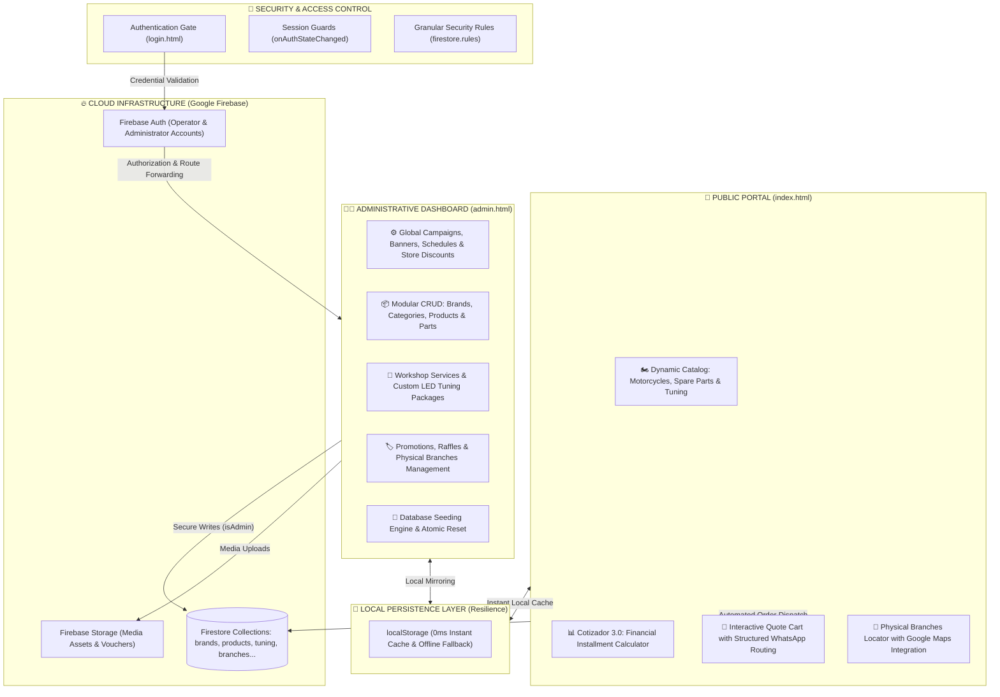

# 🏍️ AP Motors — Reactive E-Commerce Platform & Real-Time Admin Suite

<p align="left">
  <a href="README.md"></a>
  <a href="README.de.md"></a>
  <a href="README.es.md"></a>
</p>

> 🌐 **Available Languages / Idiomas / Sprachen:** [🇬🇧 English](README.md) • [🇩🇪 Deutsch](README.de.md) • [🇪🇸 Español](README.es.md)

---

[](https://apmotors-6bece.web.app)
[](https://apmotors-6bece.web.app)

[](https://developer.mozilla.org/)
[](https://developer.mozilla.org/)
[](https://developer.mozilla.org/)
[](https://firebase.google.com/)
[](https://firebase.google.com/)
[](https://firebase.google.com/)
[](https://www.whatsapp.com/)

> [!TIP]
> ### 🌐 Live Production Platform for Reviewers
> **Click here to interact directly with the live deployed production version:**  
> 👉 **[https://apmotors-6bece.web.app](https://apmotors-6bece.web.app)**  
> 
> *Direct access to the public main page: explore the dynamic motorcycle catalog, interactive technical specifications, the **Cotizador 3.0** (financing installment calculator), and real-time quote cart without requiring credentials or login.*

Welcome to **AP Motors**, a high-performance commercial web platform built for multi-brand automotive and motorcycle dealerships (authorized dealers for **RONCO**, **NEXUS**, and **SUMO** in Southern Peru).

The system seamlessly integrates an **ultra-fast public client portal** with a centralized, real-time administrative **CRUD dashboard**, powered by Google Firebase serverless cloud services (**Firestore, Auth, and Hosting**) and an offline-resilient local cache architecture delivering 0ms response times.

---

## 🏛️ System Architecture



---

## 🌟 Technical Highlights & Core Modules

### 1. 🏍️ Reactive Real-Time Commercial Catalog
- **`onSnapshot` Bidirectional Synchronization**: Any modification to pricing, inventory, or promotional banners executed from the admin dashboard propagates instantly to connected client sessions without page refreshes.
- **Multi-Criteria Filtering**: Filter vehicles and inventory by authorized brand, category (Work Motos, Sport, Official Spare Parts, LED Tuning Kits), price ranges, and real-time stock availability.
- **Technical Specification Modals**: Interactive detail overlays displaying engine displacement (cc), fuel system, official 1-year warranty terms, and direct WhatsApp inquiry triggers per vehicle.

### 2. 📊 Cotizador 3.0: Financial Installment Simulator & WhatsApp Dispatch
- **Live Credit & Financing Calculator**: Dynamic sliders allow potential buyers to calculate down payments (*inicial mínima*), payment schedules (6, 12, 18, 24 months), and estimated monthly fees.
- **Structured URL-Encoded WhatsApp Routing**: Compiles the selected financing parameters into a clean, pre-filled WhatsApp message routed directly to customer service agents:
  ```text
  Hello AP MOTORS, I would like to request a quote:
  - Model: Ronco Pantera 200cc
  - List Price: S/ 5,800
  - Down Payment: S/ 1,500
  - Term: 12 monthly installments
  ```

### 3. 🛒 Interactive Quote & Order Cart
- Persistent client-side cart leveraging browser storage.
- Real-time order summary calculation including grand opening promotional discounts (e.g., 20% OFF), dynamic taxes, and structured checkout routing directly via WhatsApp.

### 4. 👨‍💼 Enterprise Admin Suite (Zero-Code CRUD Control)
- **Full Operational Governance**:
  - **Brands & Categories**: Create and adjust hierarchical display priority.
  - **Products & Spare Parts**: Manage list prices, promotional prices, technical specs, and media assets.
  - **Workshop Services & Custom Tuning**: Maintain preventive maintenance schedules, electronic tuning options, and custom LED installations.
  - **Branches & Mapping**: Physical location addresses, business hours, and automated Google Maps embed coordinates.
  - **Global Campaign Controls**: Instant updates to top notification banners, global discount percentages, and customer hotline numbers.
- **Automated Seeding Engine**: One-click initial seeder that initializes Firestore with production-ready default datasets if empty.

### 5. ⚡ 0ms Latency & Offline Fallback
- Hybrid caching strategy: catalog data loads instantly from `localStorage`, ensuring a near-instant First Contentful Paint (**FCP < 0.4s**) while Firestore establishes its background real-time listener.

---

## 🔒 Security & Privacy Architecture

- **Principle of Least Privilege (RBAC)**: Firestore database access is governed by strict declarative rules (`firestore.rules`):
  - **Public Read Access (`allow read: if true`)**: Enables unrestricted client viewing of catalog inventory, branch locations, and active campaigns.
  - **Restricted Write Access (`allow write: if isAdmin()`)**: Mutations (create, update, delete) require a cryptographically verified token from Firebase Auth.
- **Client Route Guards**: Protected administration views (`admin.html`) observe authentication states via `firebase.auth().onAuthStateChanged` and redirect unauthenticated sessions to `/login.html`.
- **Portfolio Data Sanitization**: The repository excludes all private backend service keys (`serviceAccountKey.json`), PEM certificates, and personal client contact data. All public-facing data points use standard demo representations.

---

## 📁 Project Structure

```text
apmotors-web/
├── index.html                  # Public storefront and reactive catalog
├── login.html                  # Secure admin authentication (Firebase Auth)
├── admin.html                  # Comprehensive administrative CRUD dashboard
├── 404.html                    # Custom branded 404 error page
├── firebase.json               # Firebase Hosting CDN configuration, headers & rewrites
├── .firebaserc                 # Firebase CLI project linkage
├── firestore.rules             # Declarative security rules for Firestore
├── storage.rules               # Granular access control rules for Firebase Storage
├── database.rules.json         # Realtime Database fallback rules
├── .gitignore                  # Strict exclusion of build caches, logs & credentials
├── LICENSE                     # Professional portfolio exhibition license
├── README.md                   # Primary documentation in English
├── README.de.md                # Comprehensive documentation in German
├── README.es.md                # Comprehensive documentation in Spanish
│
├── css/                        # Modular CSS system
│   ├── styles.css              # Public storefront styles (responsive, dark theme)
│   ├── admin.css               # Administrative dashboard, data tables & modals
│   └── login.css               # Login authentication card styling
│
├── js/                         # Vanilla ES6+ Modular Architecture
│   ├── firebase.js             # Firebase SDK client initialization (Auth, Firestore, Storage)
│   ├── firebase.config.example.js # Environment credential template
│   ├── data.js                 # Data access layer, onSnapshot listener & local cache
│   ├── main.js                 # Public UI logic, Cotizador 3.0, filters & cart
│   ├── admin.js                # Admin CRUD operations, form validation & database seeder
│   └── login.js                # Auth state management, error handling & redirection
│
└── assets/                     # Graphic resources and media assets
    └── img/
        ├── logo-apmotors.png   # Brand vector logo
        ├── promo-descuento-20.jpg
        ├── promo-motos-financiamiento.jpg
        └── promo-sorteo-moto.jpg
```

---

## 🚀 Getting Started & Deployment

### Prerequisites
- Modern web browser (Chrome, Edge, Firefox, Safari).
- Node.js (optional, only if using local dev servers or the Firebase CLI).

### 🌐 1. Live Production Demo (Cloud CDN)
To inspect and evaluate the full user journey without cloning or local setup:
👉 **[Access the Live Main Page: https://apmotors-6bece.web.app](https://apmotors-6bece.web.app)**

### 💻 2. Running in a Local Environment
You can serve the project using any local HTTP static server:

```bash
# Option A: Using npx serve
npx serve .

# Option B: Using Python
python -m http.server 8080

# Option C: Using VS Code / Cursor "Live Server" extension on index.html
```

Open your browser to the main page:
- **Main Page**: `http://localhost:8080` (or `http://localhost:8080/index.html`)

### 🚀 3. Deploying to Firebase Hosting
To deploy to your own Firebase infrastructure:

```bash
# 1. Install Firebase CLI
npm install -g firebase-tools

# 2. Login to Firebase
firebase login

# 3. Deploy Hosting and Security Rules
firebase deploy
```

---

## 📄 License & Intellectual Property

**Copyright © 2026 Cristhian PE — AP Motors. All rights reserved.**

This repository is published **strictly for technical exhibition, architectural demonstration, and professional evaluation by recruiters and hiring managers**. Unauthorized commercial duplication, scraping, or redistribution of this software or its source code is strictly prohibited. For additional details, refer to the [`LICENSE`](LICENSE) file.

---

© 2026 **AP Motors** • Developed by **Cristhian PE** • Professional Portfolio Showcase.
