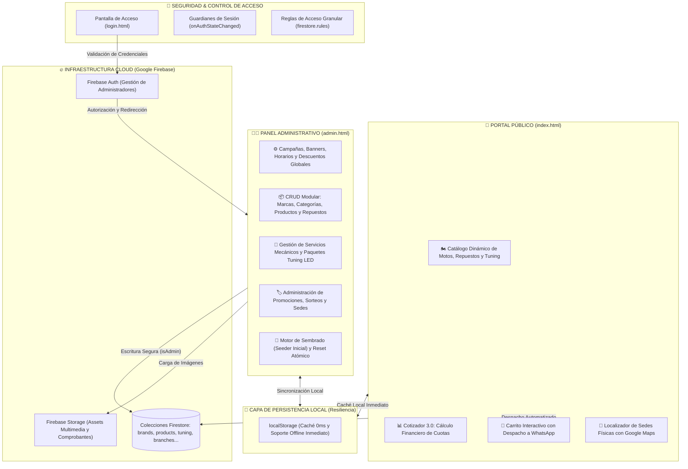

# 🏍️ AP Motors — Plataforma Comercial Reactiva & Panel Administrativo en Tiempo Real

[](https://developer.mozilla.org/)
[](https://developer.mozilla.org/)
[](https://developer.mozilla.org/)
[](https://firebase.google.com/)
[](https://firebase.google.com/)
[](https://firebase.google.com/)
[](https://www.whatsapp.com/)

Bienvenido a **AP Motors**, una plataforma web comercial de alto rendimiento diseñada para la exhibición, cotización interactiva y gestión integral de inventario de concesionarias automotrices y de motocicletas (distribuidores autorizados de **RONCO**, **NEXUS** y **SUMO** en el sur del Perú).

El sistema combina un **portal público ultra-rápido** para clientes con un **panel administrativo centralizado (CRUD)** en tiempo real, respaldado por la infraestructura serverless de **Google Firebase (Firestore, Auth y Hosting)** y un motor de resiliencia local con soporte offline de 0ms.

---

## 🏛️ Arquitectura del Sistema



---

## 🌟 Capacidades Técnicas & Módulos Destacados

### 1. 🏍️ Catálogo Comercial Reactivo en Tiempo Real
- **Sincronización `onSnapshot`**: Cualquier modificación en precios, productos o promociones realizada por el administrador se refleja instantáneamente en las pantallas de los usuarios sin necesidad de recargar la página.
- **Filtros Dinámicos**: Filtrado multi-criterio por marcas oficiales, categorías (Motos de Trabajo, Deportivas, Repuestos Oficiales, Tuning LED), rangos de precios y disponibilidad.
- **Modales de Inspección Técnica**: Fichas técnicas completas con especificaciones de motor (cilindrada cc), tipo de combustible, garantía oficial de 1 año y botones de contacto directo por producto.

### 2. 📊 Cotizador Financiero 3.0 & Ruteo a WhatsApp
- **Simulador de Financiamiento en Vivo**: Los usuarios pueden interactuar con sliders dinámicos para calcular cuotas mensuales, inicial mínima recomendada y plazos de amortización.
- **Generador de Enlace WhatsApp Estructurado**: Convierte la cotización seleccionada en un mensaje preformateado codificado en URL listo para ser atendido por el equipo de ventas:
  ```text
  Hola AP MOTORS, deseo cotizar:
  - Modelo: Ronco Pantera 200cc
  - Precio de Lista: S/ 5,800
  - Inicial propuesta: S/ 1,500
  - Plan de cuotas: 12 meses
  ```

### 3. 🛒 Carrito de Cotización y Compra
- Persistencia del carrito en el navegador.
- Resumen en tiempo real de artículos seleccionados, cálculo de descuentos promocionales de inauguración (ej. 20% OFF) y consolidación del pedido para su despacho directo vía WhatsApp.

### 4. 👨‍💼 Panel de Administración Centralizado (CRUD Enterprise)
- **Control Total sin Código**: El administrador gestiona de punta a punta:
  - **Marcas y Categorías**: Creación y ordenamiento jerárquico.
  - **Productos y Repuestos**: Control de stock, precios regulares vs. precios de oferta, especificaciones técnicas y URLs multimedia.
  - **Servicios de Taller & Tuning**: Catálogo de mantenimiento preventivo, afinamiento electrónico, instalación de barras LED y kits de iluminación.
  - **Sedes y Mapas**: Administración de direcciones físicas, horarios de atención y georreferenciación integrada con Google Maps Embed.
  - **Configuración de Campaña**: Modificación en vivo del banner de alerta superior, porcentaje de descuento general y teléfonos de atención.
- **Motor de Sembrado (Initial Seeder)**: Si la base de datos se encuentra vacía, el sistema ofrece una inicialización con 1 clic de datos de catálogo preconfigurados.

### 5. ⚡ Rendimiento 0ms y Resiliencia Offline
- Arquitectura de caché híbrida: los datos se leen inmediatamente desde `localStorage` garantizando una experiencia de usuario instantánea (**First Contentful Paint < 0.4s**) mientras se establece la conexión reactiva con Firestore en segundo plano.

---

## 🔒 Arquitectura de Seguridad & Privacidad

- **Principio de Mínimo Privilegio (*Least Privilege*)**: La base de datos Firestore está protegida con reglas de seguridad declarativas (`firestore.rules`):
  - **Lectura Pública (`allow read: if true`)**: Permite a los clientes consultar el catálogo, sedes y promociones sin autenticación.
  - **Escritura Restringida (`allow write: if isAdmin()`)**: Solo los usuarios con sesión verificada en Firebase Auth pueden crear, editar o eliminar registros.
- **Protección de Rutas (Auth Guards)**: Las páginas administrativas (`admin.html`) verifican reactivamente el estado de autenticación mediante `firebase.auth().onAuthStateChanged`. Si un usuario no autenticado intenta acceder, es redirigido inmediatamente a `/login.html`.
- **Sanitización de Datos en Portafolio**: El repositorio no contiene credenciales de servicio administrativas privadas (`serviceAccountKey.json`), llaves PEM ni números personales de clientes; todas las entidades expuestas utilizan identificadores y formatos demostrativos.

---

## 📁 Estructura del Proyecto

```text
apmotors-web/
├── index.html                  # Portal público comercial y catálogo reactivo
├── login.html                  # Portal de autenticación segura (Firebase Auth)
├── admin.html                  # Panel de administración central (CRUD completo)
├── 404.html                    # Pantalla de error amigable personalizada
├── firebase.json               # Configuración de Firebase Hosting, headers y rewrites
├── .firebaserc                 # Vinculación del proyecto en Firebase CLI
├── firestore.rules             # Reglas de seguridad granulares para Firestore
├── storage.rules               # Reglas de control de acceso para Firebase Storage
├── database.rules.json         # Reglas de respaldo RTDB
├── .gitignore                  # Exclusión estricta de cachés, logs y credenciales
├── LICENSE                     # Licencia de exhibición profesional de portafolio
│
├── css/                        # Estilos modulares desacoplados
│   ├── styles.css              # Sistema visual de la web pública (responsive, dark theme)
│   ├── admin.css               # Estilos del panel administrativo, tablas y modales
│   └── login.css               # Diseño de la tarjeta de inicio de sesión
│
├── js/                         # Lógica JavaScript (Vanilla ES6+ Modular)
│   ├── firebase.js             # Inicialización de servicios Firebase (Auth, Firestore, Storage)
│   ├── firebase.config.example.js # Plantilla de configuración de entorno
│   ├── data.js                 # Capa de datos modular, sincronización onSnapshot y caché local
│   ├── main.js                 # Lógica interactiva pública, cotizador 3.0, filtros y carrito
│   ├── admin.js                # Lógica del panel CRUD, validaciones y motor de sembrado
│   └── login.js                # Manejo de sesiones, control de errores y redirecciones
│
└── assets/                     # Recursos gráficos y multimedia
    └── img/
        ├── logo-apmotors.png   # Logotipo vectorial de la marca
        ├── promo-descuento-20.jpg
        ├── promo-motos-financiamiento.jpg
        └── promo-sorteo-moto.jpg
```

---

## 🚀 Puesta en Marcha Local y Despliegue

### Prerrequisitos
- Navegador web moderno (Chrome, Edge, Firefox, Safari).
- Node.js (opcional, para servir localmente o utilizar Firebase CLI).

### 1. Ejecución Local Inmediata
Puedes ejecutar el proyecto con cualquier servidor estático local:

```bash
# Opción A: Con npx serve
npx serve .

# Opción B: Con Python
python -m http.server 8080

# Opción C: Usando la extensión Live Server de VS Code / Cursor sobre index.html
```

Abre en tu navegador:
- Portal Público: `http://localhost:8080` (o `index.html`)
- Login de Administrador: `http://localhost:8080/login.html`

### 2. Despliegue a Producción (Firebase Hosting)
Si deseas desplegar tu propia instancia en Firebase:

```bash
# 1. Instala Firebase CLI
npm install -g firebase-tools

# 2. Inicia sesión en Firebase
firebase login

# 3. Despliega la aplicación completa (Hosting + Reglas)
firebase deploy
```

---

## 📄 Licencia y Propiedad Intelectual

**Copyright © 2026 Cristhian PE — AP Motors. Todos los derechos reservados.**

Este proyecto se publica **exclusivamente con fines de exhibición técnica, demostración arquitectónica y evaluación profesional para reclutadores**. Queda prohibida su reproducción comercial no autorizada o distribución sin previo consentimiento por escrito del autor. Para más detalles, consulta el archivo [`LICENSE`](LICENSE).

---

© 2026 **AP Motors** • Desarrollado por **Cristhian PE** • Exhibición de Portafolio Profesional.
